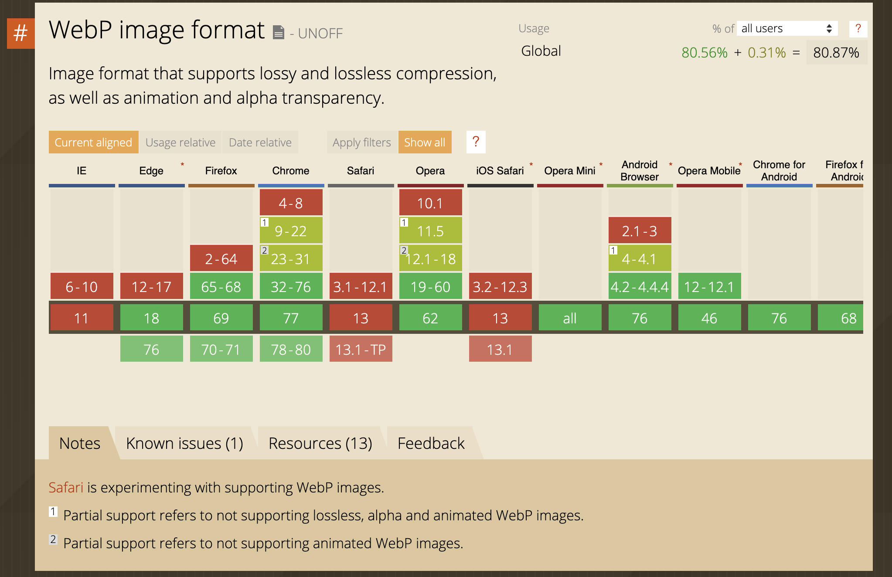

Le format WebP est un format d'image développé et mis à disposition par Google. Il est destiné à remplacer les formats JPEG et PNG. A qualité égale, le format propose des images d'environ 30% plus légères. Le format permet de produire des images sans perte (comme le PNG) ou compressées (comme le JPEG), autorise la transparence et les images animées.

## Exporter des WebP

Les images peuvent être exportées au format WebP depuis ces logiciels:

- [WebPonize](https://webponize.org), une petite application gratuite pour convertir des images en WebP.
- [Sketch](https://www.sketch.com/)
- Pixelmator
- Google [propose une extension](https://developers.google.com/speed/webp/docs/webpshop) pour l'export depuis Photoshop.

## Support dans les navigateurs

En automne 2019, [selon le site CanIUse](https://caniuse.com/#search=webp), le format WebP n'est pas pris en charge dans Safari, mais fonctionne dans Edge, Chrome et Firefox.

## Support dans MacOS

Pour pouvoir afficher les images WebP dans le finder, il est nécessaire d'installer un utilitaire. Vous trouverez des informations [sur StackOverflow](https://apple.stackexchange.com/questions/285698/webp-support-on-macos-is-it-indended-to-actually-work).